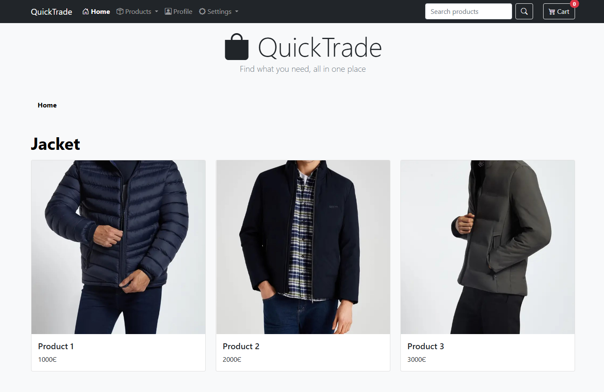
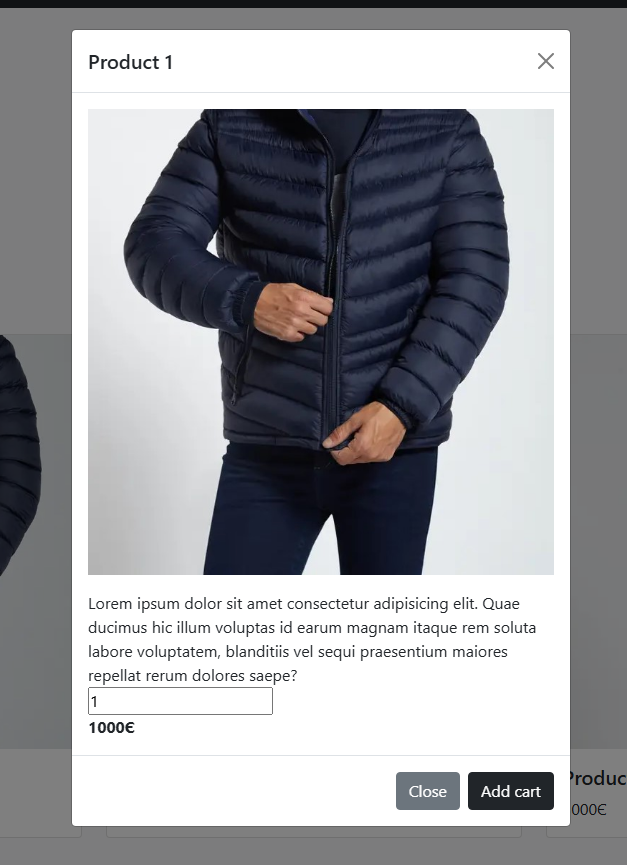
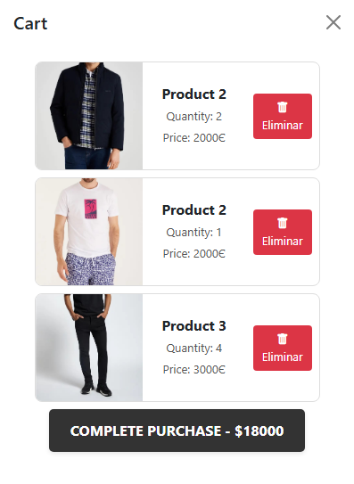

# QuickTrade - E-commerce Interface

**QuickTrade** is a modern, responsive e-commerce landing page designed to provide a seamless online shopping experience. The project features a clean frontend architecture powered by **Bootstrap** for styling and **jQuery** for dynamic DOM manipulation and cart management.

## 🌐 Live Demo

You can view the live project here: **[QuickTrade Live](https://quicktrade1.netlify.app)**

## 🖼️ User Interface (UI)

This section showcases the visual design and key interactive components of the platform.

### Main Dashboard

The landing page features a dark navigation bar, a search system, and a categorized product grid (Jackets, T-shirts, and Trousers).

### Product Interaction & Cart

Users can view product details through modals and manage their purchases via a dynamic side-cart.

| Product Modal | Shopping Cart (Offcanvas) |
| :---: | :---: |
|  |  |
